# מדריך מנהל — Strateger (מירוץ + מקצה דירוג)

**Admin Walkthrough — Race & Qualifying**

מדריך תפעולי לצוות אסטרטגיה במסלול. מבוסס על סימולציה חיה באתר  
**https://strateger.onrender.com**

**Document version:** 1.0 · **Languages:** עברית + English  
**Tested:** July 2026 · **Devices:** Laptop (1440×900) · Tablet (768×1024) · Phone (390×844)

> **Screenshots:** `docs/walkthrough/screenshots/` — captured live from the hosted app.

---

## איפה המדריך? / Where Is This Guide?

| איך לפתוח | How to open |
|---|---|
| **בפרויקט (Cursor / VS Code)** | Open file: `strateger/docs/walkthrough/MADRICH-STRATEGER-ADMIN.md` |
| **נתיב מלא** | `C:\Users\yanih\Music\MyProjects\strateger\docs\walkthrough\MADRICH-STRATEGER-ADMIN.md` |
| **צילומי מסך** | Same folder → `screenshots/` (21 PNG files) |
| **Preview** | In Cursor: open the `.md` file → **Markdown Preview** (Ctrl+Shift+V) to see images inline |
| **PDF / Word** | Export from preview, or use Pandoc / copy to Google Docs |

The guide is **already in your repo** — it is not on the website. The live app is at [strateger.onrender.com](https://strateger.onrender.com); this document is the admin manual for it.

---

## התחלה מהירה / Quick Start

| שלב | Step | EN | HE |
|-----|------|----|----|
| 1 | Open app | [strateger.onrender.com](https://strateger.onrender.com) | |
| 2 | Choose language | 🇬🇧 EN or 🇮🇱 HE (top-left) | |
| 3 | Set race params | Duration, stops, min/max stint, pit time | |
| 4 | Add drivers | Names + colors + STARTER | |
| 5 | Qualifying (optional) | **Qualifying + Race** → **Start Qualifying** | **מקצה דירוג + מירוץ** → **התחל מקצה דירוג** |
| 6 | Start race | **START RACE** | **התחל מירוץ** |
| 7 | During race | Tap **ENTER PIT** / **Exit Pits** at **real times** — not the plan | **כניסה לפיטס** / **יציאה מהפיט** לפי **זמן אמת** |
| 8 | After drift | Open **▶ PLAN** — remaining stints auto-adjust | **▶ תוכנית** — סטינטים שנותרו מתעדכנים |

---

## תוכן עניינים / Table of Contents

1. [סקירה כללית / Overview](#1-סקירה-כללית--overview)
2. [כניסה והגדרות / Access & Setup](#2-כניסה-והגדרות--access--setup)
3. [מקצה דירוג / Qualifying](#3-מקצה-דירוג--qualifying)
4. [תחילת מירוץ / Starting the Race](#4-תחילת-מירוץ--starting-the-race)
5. [לוח מחוונים חי / Live Race Dashboard](#5-לוח-מחוונים-חי--live-race-dashboard)
6. [פיטסטופ וחילוף נהג / Pit Stop & Driver Swap](#6-פיטסטופ-וחילוף-נהג--pit-stop--driver-swap)
7. [סטייה מהתוכנית — אסטרטגיה דינמית / Strategy Recalculation](#7-סטייה-מהתוכנית--אסטרטגיה-דינמית--strategy-recalculation)
8. [תרחישים אמיתיים / Real Race Scenarios](#8-תרחישים-אמיתיים--real-race-scenarios)
9. [סיום מירוץ / Race Finish](#9-סיום-מירוץ--race-finish)
10. [תצוגה לפי מכשיר / Responsive Layouts](#10-תצוגה-לפי-מכשיר--responsive-layouts)
11. [טיפים מהירים / Quick Reference](#11-טיפים-מהירים--quick-reference)
12. [תחזית אסטרטגיה + בלתי אפשרי / Strategy Outlook & IMPOSSIBLE](#12-תחזית-אסטרטגיה--בלתי-אפשרי--strategy-outlook--impossible)
13. [תזמון חי — הרבה קבוצות / Live Timing (Many Teams)](#13-תזמון-חי--הרבה-קבוצות--live-timing-many-teams)

---

## 1. סקירה כללית / Overview

### מה Strateger עושה / What Strateger Does

| תפקיד / Role | עברית | English |
|---|---|---|
| **תכנון** | חישוב סטינטים, עצירות חובה, חלוקת זמן בין נהגים | Calculate stints, mandatory stops, driver time split |
| **מקצה דירוג** | ניהול Q1/Q2/Q3, ריצות לנהג, תוצאות | Manage Q1/Q2/Q3, runs per driver, results |
| **מירוץ חי** | טיימרים, כניסה לפיטס, חילוף נהג, PUSH/PROBLEM | Live timers, pit entry, driver swap, PUSH/PROBLEM |
| **התאמה דינמית** | עדכון אסטרטגיה לפי זמנים **בפועל** — לא רק לפי התוכנית | Recalculate strategy from **actual** timestamps, not just the plan |

### כתובת האתר / Site URL

```
https://strateger.onrender.com
```

> **הערה:** האפליקציה היא PWA — ניתן להוסיף למסך הבית בטאבלט/טלפון לגישה מהירה במסלול.  
> **Note:** The app is a PWA — add to home screen on tablet/phone for quick pit-lane access.

### מכשיר מומלץ / Recommended Device

| מכשיר | שימוש | Device | Use |
|---|---|---|---|
| **טאבלט (768px)** | הכי נפוץ במסלול — מסך מלא, כפתורים גדולים | **Tablet** | Most common trackside — full layout, large buttons |
| **לפטופ** | תכנון לפני המירוץ + תצוגת אסטרטגיה | **Laptop** | Pre-race planning + strategy preview |
| **טלפון** | גיבוי / צוות קטן | **Phone** | Backup / small crew |

---

## 2. כניסה והגדרות / Access & Setup

### שלב 1 — פתיחת האפליקציה / Step 1 — Open the App

1. גלוש ל-**https://strateger.onrender.com**
2. בחר שפה: **🇮🇱 HE** (עברית) או **🇬🇧 EN** (English) — בפינה העליונה
3. הזן **שם קבוצה** (Team Name) — למשל: `Team Apex Racing`

### שלב 2 — בחירת מצב / Step 2 — Choose Mode

| כפתור | עברית | מתי להשתמש |
|---|---|---|
| **Race Only** | מירוץ בלבד | מירוץ סיבולת בלבד, ללא מקצה |
| **Qualifying + Race** | מקצה דירוג + מירוץ | יום מירוץ מלא — מקצה ואז מירוץ |

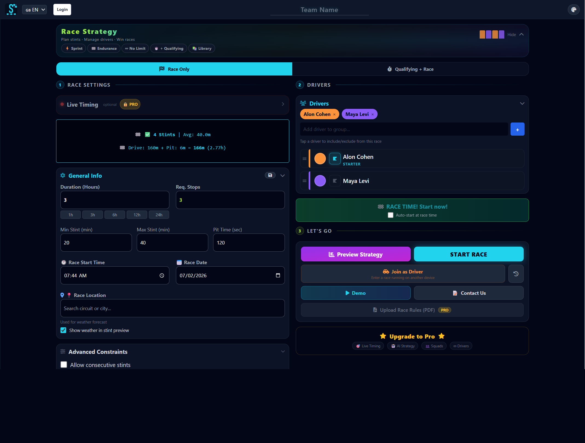
*Laptop · English · Race Only mode*

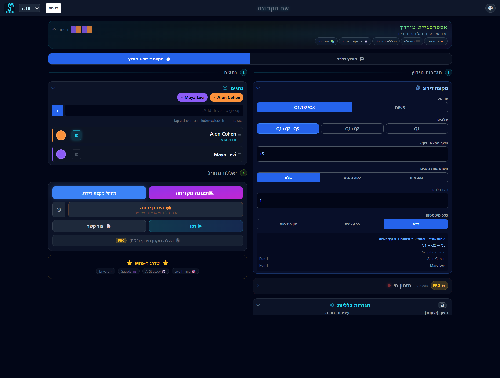
*Laptop · Hebrew (RTL) · Qualifying + Race mode*

### שלב 3 — הגדרות מירוץ / Step 3 — Race Settings

מלא את **General Info** לפי תקנון המירוץ:

| שדה | Field | דוגמה / Example | הסבר |
|---|---|---|---|
| Duration (Hours) | משך (שעות) | `3` | משך המירוץ |
| Req. Stops | עצירות חובה | `3` | מספר פיטסטופים חובה |
| Min Stint (min) | מינימום סטינט | `20` | זמן מינימום לנהג במסלול |
| Max Stint (min) | מקסימום סטינט | `40` | זמן מקסימום לנהג במסלול |
| Pit Time (sec) | זמן פיטס | `45–120` | זמן עצירה בפיט (שניות) |
| Race Start Time | שעת התחלה | `19:00` | לתזמון ולוח שנה |
| Race Date | תאריך | `2026-07-01` | |

> **טיפ מהיר:** השתמש בכפתורי **3h / 6h / 12h / 24h** לבחירה מהירה של משך המירוץ.  
> **Quick tip:** Use **3h / 6h / 12h / 24h** preset buttons for fast duration selection.

**תיבת סיכום אוטומטית:**  
האפליקציה מציגה מיד: `4 Stints | Avg: 40.0m` ו-`Drive: 160m + Pit: 6m = 166m (2.77h)`

### שלב 4 — נהגים / Step 4 — Drivers

1. הוסף נהגים דרך **"Add driver to group…"** + כפתור **+**
2. בחר **צבע** לכל נהג (מזהה ויזואלי במסלול)
3. סמן **STARTER** — הנהג שיוצא לסטינט הראשון
4. לחץ **Preview Strategy** / **תצוגה מקדימה** לראות את התוכנית המלאה לפני המירוץ

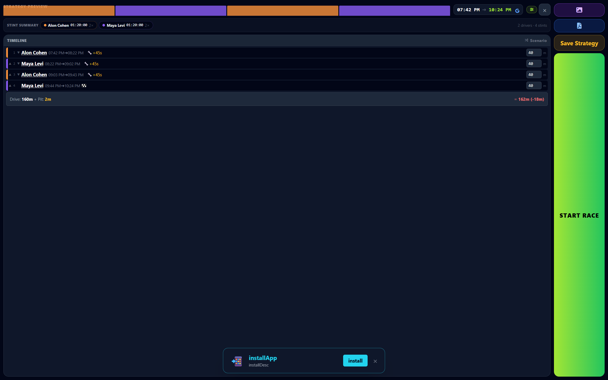
*Laptop · Strategy Preview — stint timeline before race start*

### תצוגה לפי מכשיר — Setup / Responsive — Setup

| Laptop (1440×900) | Tablet (768×1024) | Phone (390×844) |
|---|---|---|
| 2 עמודות: הגדרות + נהגים | 2 עמודות צרות, כפתורים גדולים | עמודה אחת, גלילה |
|  | 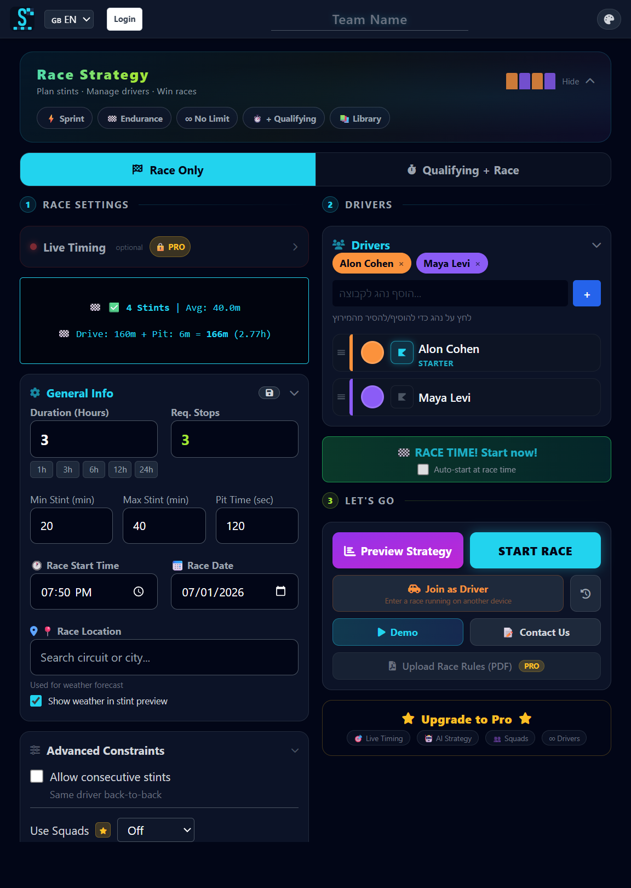 | 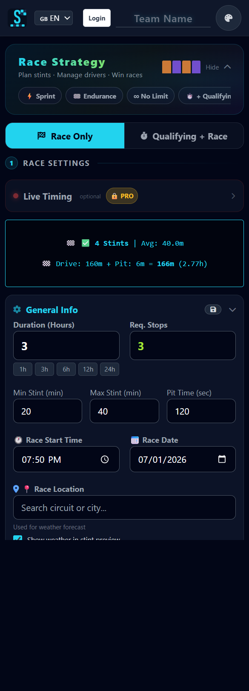 |

---

## 3. מקצה דירוג / Qualifying

### הגדרת מקצה / Qualifying Configuration

בחר **Qualifying + Race**, ואז הגדר:

| הגדרה | Setting | אפשרויות / Options |
|---|---|---|
| Format | פורמט | Simple · Q1/Q2/Q3 |
| Segments | שלבים | Q1 · Q1+Q2 · Q1+Q2+Q3 |
| Duration (min) | משך (דק') | למשל `15` |
| Driver Participation | השתתפות | One · Multiple · All |
| Runs per driver | ריצות לנהג | `1`, `2`, … |
| Pit Stop Rule | כלל פיט | None · Any stop · Min time |

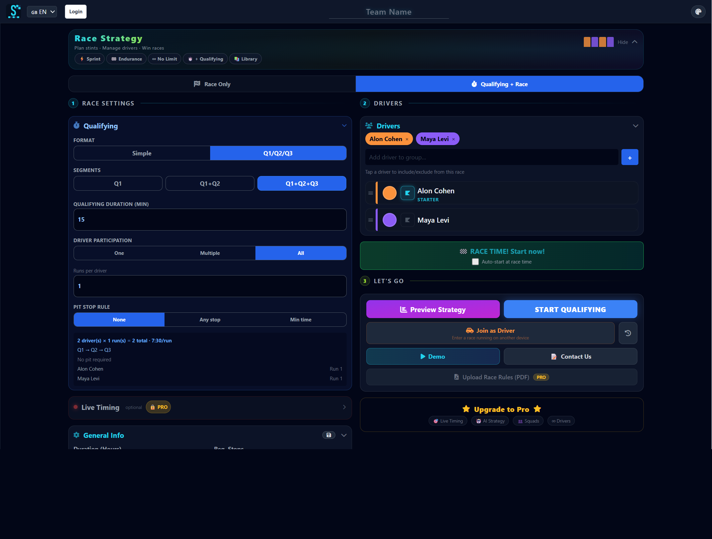

**תיבת סיכום:**  
`2 driver(s) × 1 run(s) = 2 total · 7:30/run · Q1 → Q2 → Q3 · No pit required`

### הרצת מקצה / Running Qualifying

1. לחץ **Start Qualifying** / **התחל מקצה דירוג**
2. מסך המקצה מציג:
   - **QUALIFYING Q1** + טיימר ספירה לאחור
   - **CURRENT** — הנהג הנוכחי + RUN X/Y
   - **UP NEXT** — הנהג הבא
   - **RESULTS** — ריצות שנרשמו
   - **ENTER PIT** — אם נדרש פיט במקצה
   - **Next Run** — מעבר לריצה הבאה / נהג הבא

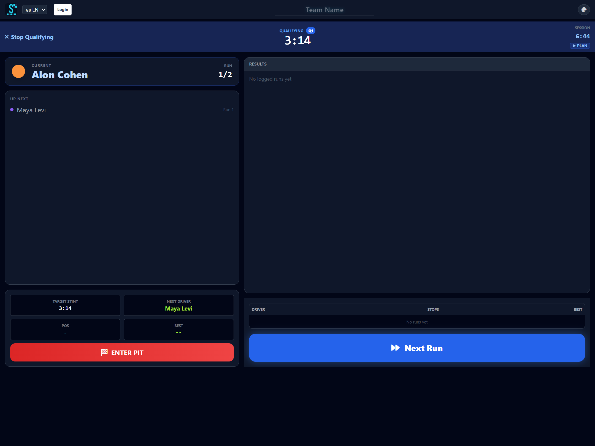

### רישום ריצה / Logging a Run

1. הנהג יוצא למסלול — הטיימר רץ
2. בסיום הריצה לחץ **Next Run**
3. התוצאה נרשמת ב-**RESULTS** (זמן, נהג, דירוג)
4. חזור על כל הנהגים → **Q2** → **Q3** (לפי ההגדרה)

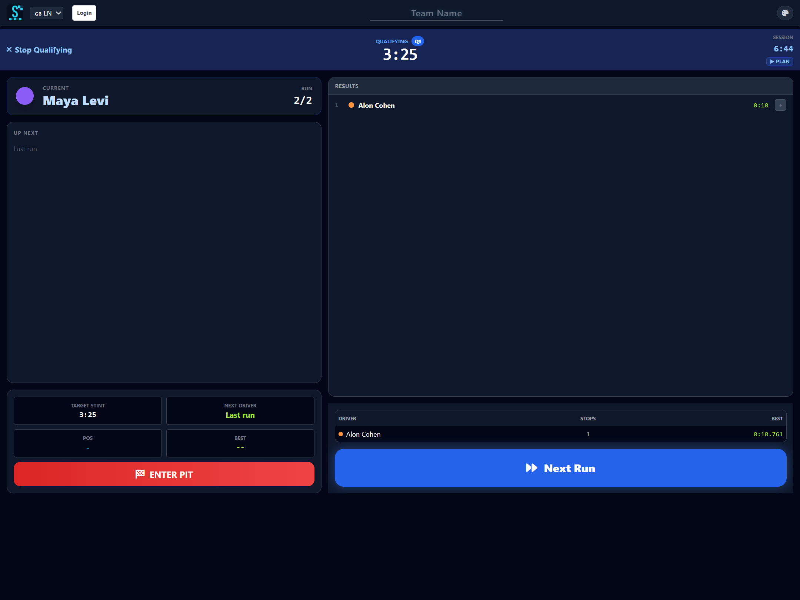

> **תרחיש אמיתי:** במקצה עם פיט חובה — לחץ **ENTER PIT** לפני יציאה מהפיט, ואז **Exit Pits** כשהנהג חוזר למסלול.

---

## 4. תחילת מירוץ / Starting the Race

1. לאחר הגדרות + נהגים → **Preview Strategy** (אופציונלי)
2. לחץ **START RACE** / **התחל מירוץ**
3. המסך עובר ל**לוח מחוונים חי**

**מה קורה ברקע:**  
האפליקציה שומרת `startTime`, `stintStart`, ו-`stintTargets[]` — מערך יעדי סטינט לכל סטינט שנותר.

---

## 5. לוח מחוונים חי / Live Race Dashboard

### אלמנטים מרכזיים / Key Elements

| אלמנט | Element | תיאור / Description |
|---|---|---|
| **RACE TIME** | זמן מירוץ | זמן שנותר / elapsed |
| **STOPS** | עצירות | `1/3` — פיטס שבוצעו / נדרשים |
| **STATUS** | מצב | On Track / IN PIT |
| **TARGET STINT** | יעד סטינט | זמן יעד לסטינט הנוכחי + סטייה (+/-) |
| **CURRENT** | נוכחי | הנהג במסלול + זמן סטינט |
| **STRATEGY OUTLOOK** | תחזית אסטרטגיה | תוכנית שנותרה (סטינטים, MAX, זמן) |
| **STRATEGY OUTLOOK** | תחזית אסטרטגיה | **הפANEL החי** — משתנה אחרי כל פיט / סטינט (ראה §12) |
| **▶ PLAN** | תוכנית | תצוגת timeline מלאה (סטינטים שבוצעו + שנותרו) |
| **🔥 PUSH** | קצב | מצב דחיפה — מקצר יעד סטינט |
| **🐢 PROBLEM** | תקלה | מצב תקלה — מאריך יעד סטינט |
| **ENTER PIT** | כניסה לפיטס | כפתור ראשי — כניסה לפיט |

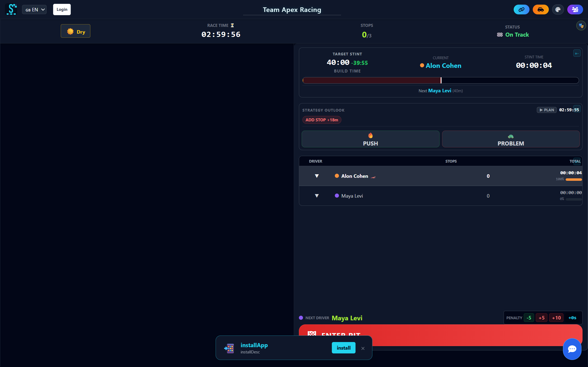
*Laptop · English · Live race dashboard at race start*

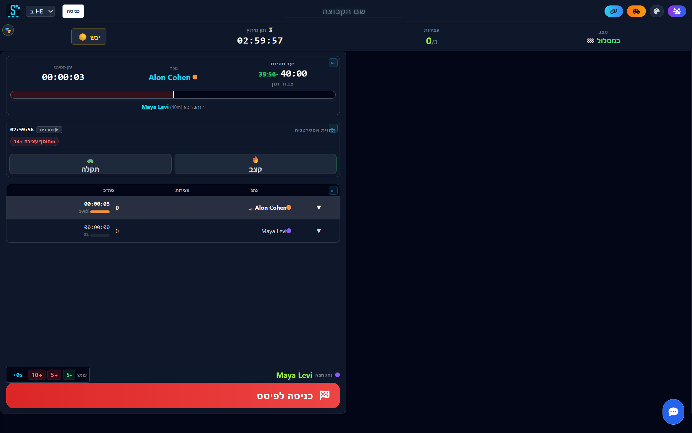
*Laptop · Hebrew (RTL) · Live race dashboard*

### מצבי PUSH / PROBLEM

| מצב | Mode | מתי / When | השפעה / Effect |
|---|---|---|---|
| **PLAN** | תוכנית | רגיל | יעד לפי `stintTargets` |
| **PUSH** | קצב | מסלול פנוי, רוצים לדחוף | יעד סטינט קצר יותר |
| **PROBLEM** | תקלה | תקלה, פקק, גשם | יעד סטינט ארוך יותר |

---

## 6. פיטסטופ וחילוף נהג / Pit Stop & Driver Swap

### תהליך פיטסטופ / Pit Stop Flow

```
On Track  →  ENTER PIT  →  IN PIT (timer)  →  Exit Pits  →  Next driver On Track
```

#### שלב 1 — כניסה לפיט / Enter Pit

1. לחץ **ENTER PIT** / **כניסה לפיטס**
2. אם הסטינט **קצר מדי** (< Min Stint) — מופיעה אזהרה:

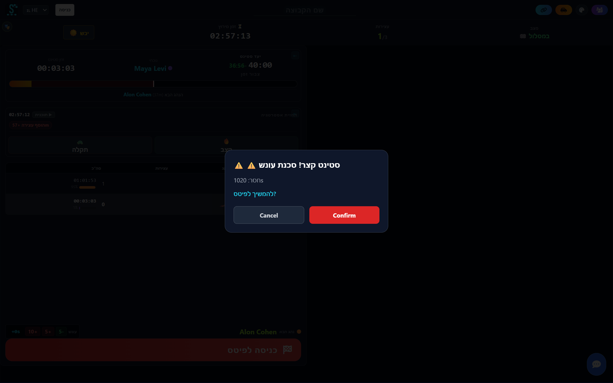

> **⚠️ SHORT STINT! Penalty Risk**  
> Missing: 1015s · Proceed to Pit?  
> **Cancel** = המשך במסלול · **Confirm** = כניסה לפיט בכל זאת

#### שלב 2 — בפיט / In Pit

- מסך **IN PIT** עם טיימר פיט
- **Next [Driver Name]** — הנהג שיוצא
- **Exit Pits** — יציאה מהפיט
- **EXIT OVERDUE** — אם הפיט ארוך מהמתוכנן

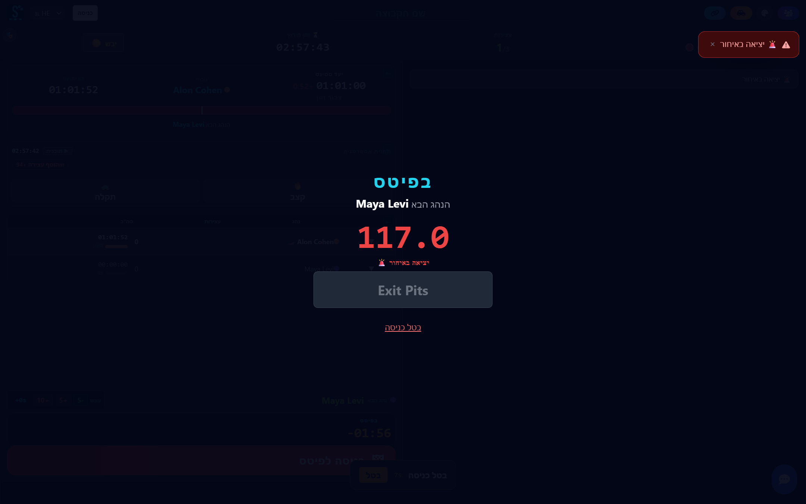

#### שלב 3 — יציאה מהפיט / Exit Pit

1. לחץ **Exit Pits**
2. הנהג הבא נכנס לסטינט
3. האפליקציה:
   - רושמת את הסטינט שהושלם (נהג + **משך בפועל**)
   - מפעילה `_recalcOnPitExit()` אם הסטייה > 3 דק'
   - מעדכנת `stintTargets` לסטינטים שנותרו

---

## 7. סטייה מהתוכנית — אסטרטגיה דינמית / Strategy Recalculation

> **עקרון מרכזי:** Strateger **לא** מכריח אותך לעקוב בדיוק אחרי התוכנית.  
> הוא **מתאים את התוכנית** לפי מה שקרה בפועל, תוך שמירה על:
> - משך המירוץ הכולל
> - Min/Max Stint
> - מספר עצירות חובה
> - חלוקה שוויונית בין נהגים (ככל האפשר)

### Key Principle

Strateger does **not** force you to follow the plan exactly.  
It **adapts the remaining plan** based on actual timestamps while respecting race parameters.

### איך זה עובד / How It Works

| מנגנון | Mechanism | מתי מופעל / Trigger |
|---|---|---|
| `_maybeRecalcAfterDrift()` | בדיקה כל ~15 שנ' | סטינט חורג > **6 דק'** מהתוכנית |
| `_recalcOnPitExit()` | ביציאה מפיט | סטינט שהושלם חורג > **3 דק'** |
| `_syncPreviewWithActuals()` | עדכון תצוגה | אחרי כל סטינט שהושלם |
| `recalculateTargetStint()` | יעד סטינט נוכחי | PUSH / PROBLEM / PLAN |

### דוגמה מסimulציה — סטינט ארוך מדי / Simulated Example — Stint Overrun

**תרחיש:** מירוץ 3 שעות, 2 נהגים, 3 עצירות, סטינט 20–40 דק'.

| | תוכנית מקורית | בפועל | אחרי התאמה |
|---|---|---|---|
| **Stint 1** (Alon Cohen) | 40 min | **62 min** ⚠️ | 62 min (ננעל) |
| **Stint 2** (Maya Levi) | 40 min | — | **39 min** |
| **Stint 3** (Alon Cohen) | 40 min | — | **39 min** |
| **Stint 4** (Maya Levi) | 40 min | — | **39 min** |

**מה קרה:**
1. Alon נשאר 22 דק' יותר מהמתוכנן (62 vs 40)
2. המערכת זיהתה drift > 6 דק' → `_maybeRecalcAfterDrift()`
3. הזמן שנותר (≈118 min) חולק ל-3 סטינטים × ~39 min (מקסימום 40)
4. ב-**▶ PLAN** — Stint 1 מוצג כ-**62m (locked/disabled)**, Stints 2–4 מעודכנים

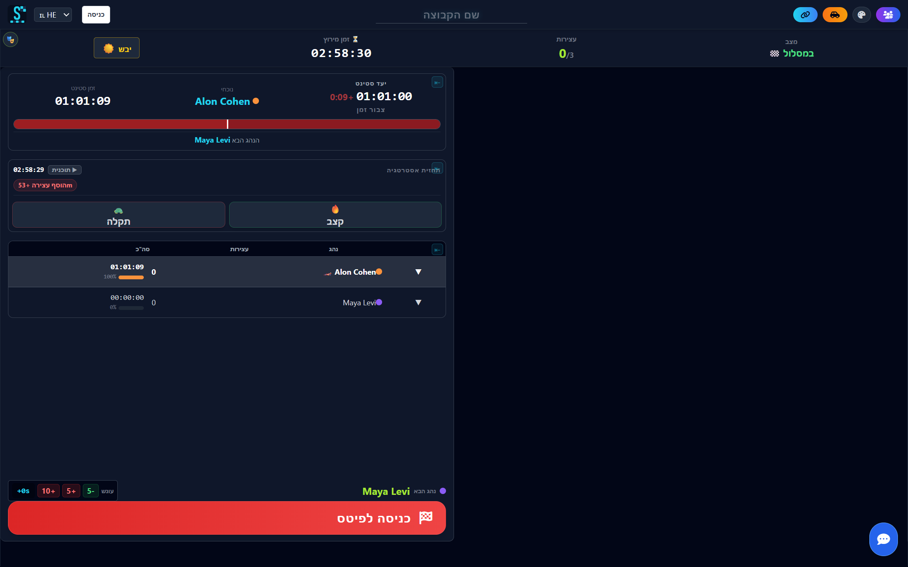
*TARGET STINT shows +0:09 (or more) — driver exceeded planned stint*

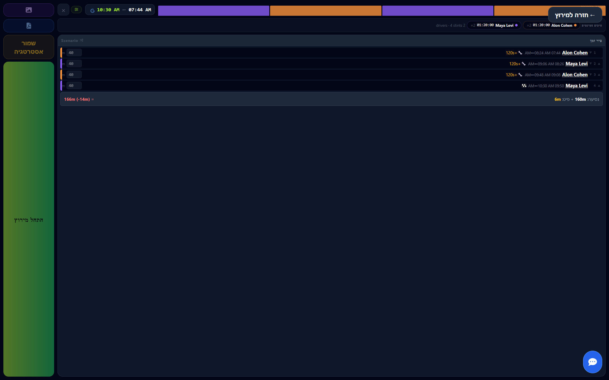

```
Stint Summary (after recalc):
  Alon Cohen  1:41:04  2× stints
  Maya Levi   1:17:42  2× stints

Timeline:
  #1  Alon Cohen   07:42 → 08:44   62m  ✓ actual
  #2  Maya Levi    08:44 → 09:23   39m
  #3  Alon Cohen   09:24 → 10:03   39m
  #4  Maya Levi    10:04 → 10:43   39m  🏁
```

> **מסר לצוות:** אם הגעתם לפיט 10 דק' מוקדם/מאוחר — **אל תדאגו**.  
> לחצו ENTER PIT / Exit Pits בזמן האמת. האפליקציה תעדכן את שאר המירוץ.

---

## 8. תרחישים אמיתיים / Real Race Scenarios

### תרחיש A — סטינט ארוך (Safety Car / פקק) / Long Stint

| שלב | פעולה / Action |
|---|---|
| 1 | הנהג נשאר במסלול יותר מהמתוכנן |
| 2 | **STRATEGY OUTLOOK** מתעדכן (למשל: `2× MAX (40m) + 15m`) |
| 3 | TARGET STINT מראה סטייה שלילית (אדום) |
| 4 | בפיט — Exit Pits → recalc אוטומטי |
| 5 | ▶ PLAN — בדוק שהסטינטים הבאים מעודכנים |

### תרחיש B — פיט מוקדם (תקלה) / Early Pit

| שלב | פעולה / Action |
|---|---|
| 1 | ENTER PIT לפני Min Stint |
| 2 | ⚠️ **SHORT STINT! Penalty Risk** — Missing: XXXs |
| 3 | **Confirm** = ממשיכים (יודעים שיש סיכון לעונש) |
| 4 | **Cancel** = חוזרים למסלול |
| 5 | אחרי Confirm — recalc מפזר זמן על הסטינטים שנותרו |

### תרחיש C — פיט ארוך (EXIT OVERDUE) / Slow Pit Stop

| שלב | פעולה / Action |
|---|---|
| 1 | IN PIT — טיימר רץ |
| 2 | 🚨 **EXIT OVERDUE** — הפיט ארוך מהמתוכנן |
| 3 | Exit Pits ברגע שהנהג יוצא |
| 4 | זמן הפיט נרשם בפועל → משפיע על התוכנית |

### תרחיש D — PUSH / PROBLEM במסלול

| מצב | מתי | פעולה |
|---|---|---|
| **🔥 PUSH** | מסלול פנוי, רוצים לרוץ מהר | לחץ PUSH → יעד סטינט קצר |
| **🐢 PROBLEM** | גשם, תאונה, עייפות | לחץ PROBLEM → יעד סטינט ארוך |
| **▶ PLAN** | חזרה לרגיל | לחץ PLAN |

### תרחיש E — עונש זמן / Time Penalty

כפתורי **-5 / +5 / +10 / +0s** בתחתית המסך — הוספת/הורדת שניות מהמירוץ (לפי החלטת שופטים).

---

## 9. סיום מירוץ / Race Finish

כש**RACE TIME** מגיע ל-**FINISH**:

1. מופיע מסך **RACE FINISHED**
2. סיכום: Duration · Stints · Pit Time · Start
3. דירוג נהגים לפי זמן כולל + אחוז מהמירוץ
4. לוג פיטסטופים (נהג, זמן נהיגה, זמן פיט)
5. **Share** / **Close**

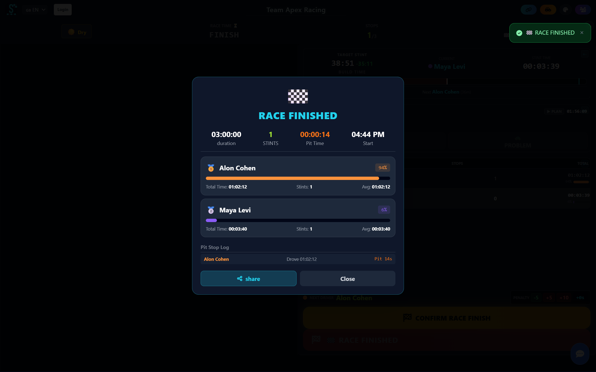

> **CONFIRM RACE FINISH** — אישור סיום המירוץ (נדרש לפני סגירה סופית).

---

## 10. תצוגה לפי מכשיר / Responsive Layouts

### Laptop (1440×900) — תכנון + מירוץ

- 2 עמודות: הגדרות | נהגים + פעולות
- לוח מירוץ: פאנל שמאל (טיימרים) + פאנל ימין (אסטרטגיה, PUSH/PROBLEM)
- תצוגת PLAN: timeline מלא + Start Race

### Tablet (768×1024) — **הכי נפוץ במסלול**

- כרטיסים ברוחב מלא, כפתורים גדולים
- ENTER PIT / Next Run בולטים
- RTL מלא בעברית
- מומלץ: landscape לתצוגת מירוץ, portrait להגדרות

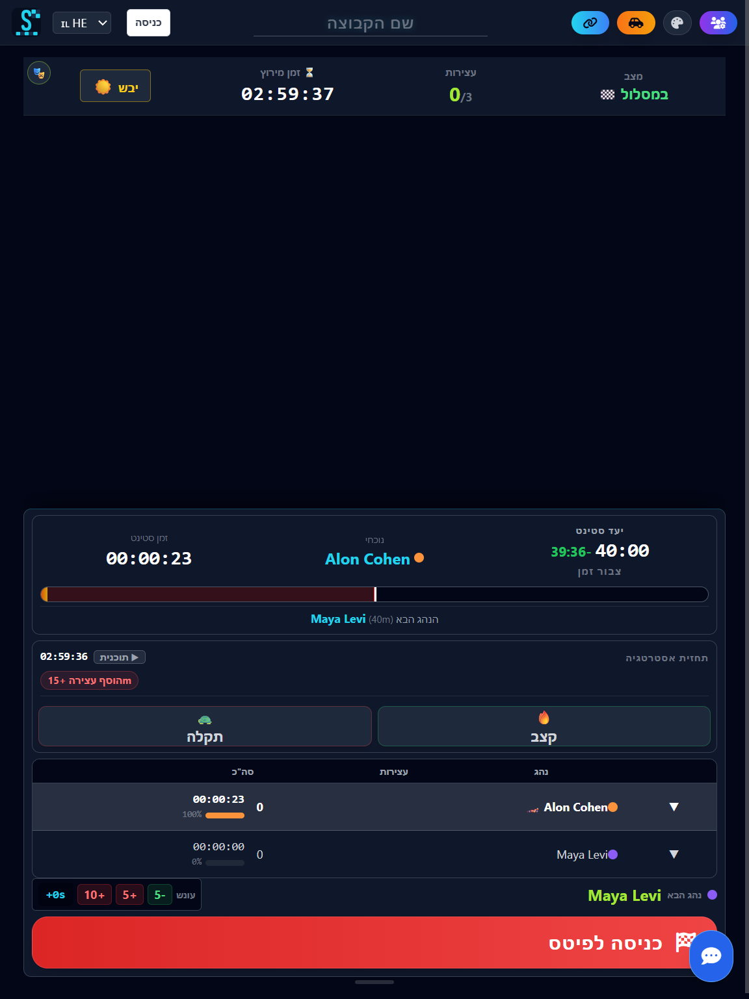

### Phone (390×844) — גיבוי

- עמודה אחת, גלילה
- טיימרים + נהג נוכחי בראש
- ENTER PIT בתחתית (גלול למטה)
- PUSH / PROBLEM כפתורים גדולים

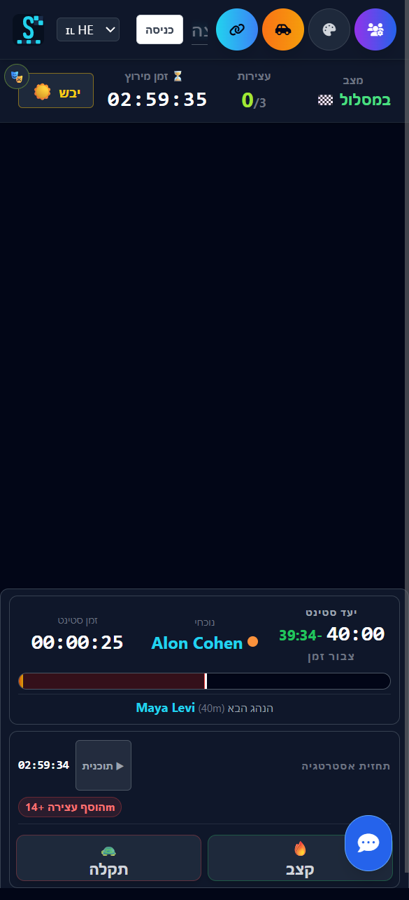
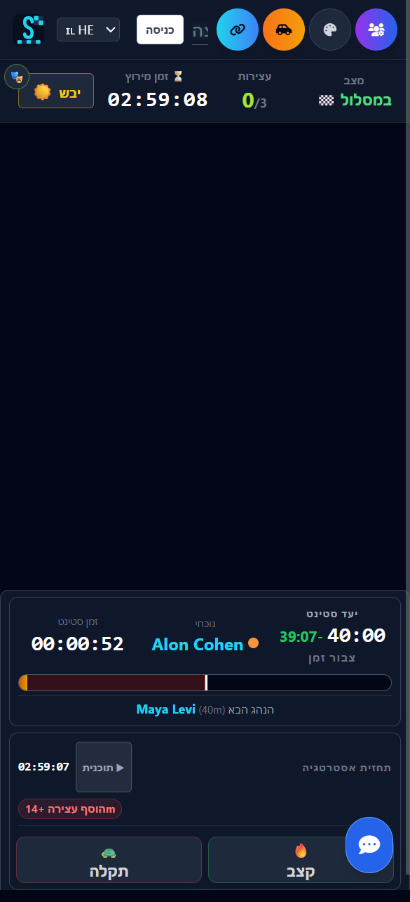

### השוואה מהירה / Quick Comparison

| תכונה | Laptop | Tablet | Phone |
|---|---|---|---|
| Setup 2-column | ✅ | ✅ (narrow) | ❌ (stacked) |
| Live timers | ✅ | ✅ | ✅ |
| ENTER PIT visible | ✅ | ✅ | ✅ (scroll) |
| PLAN timeline | ✅ full | ✅ scroll | ⚠️ compact |
| Hebrew RTL | ✅ | ✅ | ✅ |
| Recommended use | Planning | **Trackside** | Backup |

---

## 11. טיפים מהירים / Quick Reference

### לפני המירוץ / Before the Race

- [ ] שם קבוצה + נהגים + STARTER
- [ ] Duration, Req. Stops, Min/Max Stint, Pit Time
- [ ] Preview Strategy — וודא 4 stints, זמנים הגיוניים
- [ ] בחר שפה (HE/EN) לפי הצוות
- [ ] הוסף ל-Home Screen (PWA) בטאבלט

### במהלך המירוץ / During the Race

- [ ] ENTER PIT **בזמן האמת** — לא לפי התוכנית
- [ ] Exit Pits כשהנהג יוצא
- [ ] בדוק ▶ PLAN אחרי סטינט חריג
- [ ] SHORT STINT warning = החלטה מודעת (Confirm/Cancel)
- [ ] PUSH/PROBLEM לפי מצב מסלול

### אחרי סטינט חריג / After a Drift

1. ▶ PLAN → Stint 1 (actual, locked) + remaining stints updated
2. STRATEGY OUTLOOK → `Nx MAX (40m) + Xm`
3. TARGET STINT → delta (+/-) from plan
4. **אל תערוך ידנית** — המערכת מחשבת מחדש

### קיצורי דרך / Shortcuts

| פעולה | Action | EN | HE |
|---|---|---|---|
| כניסה לפיט | Pit entry | ENTER PIT | כניסה לפיטס |
| יציאה | Exit | Exit Pits | יציאה מהפיט |
| תוכנית | Plan view | ▶ PLAN | ▶ תוכנית |
| דחיפה | Push mode | 🔥 PUSH | 🔥 קצב |
| תקלה | Problem | 🐢 PROBLEM | 🐢 תקלה |
| ריצה הבאה (Q) | Next run | Next Run | ריצה הבאה |

---

## נספח — פרמטרים לדוגמה / Appendix — Example Config

**מירוץ סיבולת 3 שעות, 2 נהגים (Endurance Karting):**

```
Duration:     3 hours
Req. Stops:   3
Min Stint:    20 min
Max Stint:    40 min
Pit Time:     45 sec
Drivers:      Alon Cohen (STARTER), Maya Levi
Expected:     4 stints · ~40 min each · 3 pit stops
```

**מקצה דירוג Q1+Q2+Q3:**

```
Format:       Q1/Q2/Q3
Segments:     Q1+Q2+Q3
Duration:     15 min total
Drivers:      All (2)
Runs/driver:  1
Pit Rule:     None
Per run:      ~7:30
```

---

## 12. תחזית אסטרטגיה + בלתי אפשרי / Strategy Outlook & IMPOSSIBLE

> **זה החלק הכי חשוב במירוץ:** איך **לראות** שהאסטרטגיה השתנתה, ומתי המערכת אומרת ש**כבר לא ניתן** לעמוד בתקנון.

### איפה מסתכלים / Where to Look

During the race, on the **right column** (or below timers on tablet/phone):

```
┌─────────────────────────────────────┐
│  STRATEGY OUTLOOK          ▶ PLAN 02:58:30 │
│  ┌────────┐ ┌────────┐ ┌──────────┐   │
│  │ 2× MAX │ │ NORM 39m│ │ +14m buf │   │  ← remStintsText (pills)
│  └────────┘ └────────┘ └──────────┘   │
│  [ 🔥 PUSH ]  [ 🐢 PROBLEM ]         │
└─────────────────────────────────────┘
```

| אלמנט | Element | מה זה אומר |
|---|---|---|
| **שורת pills** (`remStintsText`) | Stint pills | תוכנית **מעודכנת** לסטינטים **שנותרו** (לא התוכנית המקורית) |
| **זמן** (`remTimeText`) | Race time left | זמן מירוץ שנותר |
| **▶ PLAN** | Full timeline | פותח timeline — סטינטים שבוצעו (ננעלים) + עתידיים |

### מתי האסטרטגיה מתעדכנת / When It Updates

| אירוע | Event | מה משתנה |
|---|---|---|
| כל ~15 שנ' במסלול | Every ~15s on track | `_maybeRecalcAfterDrift()` אם סטינט חורג > 6 דק' |
| **Exit Pits** | Pit exit | `_recalcOnPitExit()` — סטינט שהושלם נרשם, יעדים עתידיים מתעדכנים |
| **ENTER PIT** (מוקדם) | Early pit | recalc — זמן שנותר מחולק מחדש על הסטינטים שנשארו |
| **PUSH / PROBLEM** | Mode change | יעד הסטינט **הנוכחי** משתנה (לא בהכרח כל התוכנית) |

**אחרי כל פיט** — בדוק:
1. **STRATEGY OUTLOOK** — האם ה-pills השתנו? (למשל `2× MAX (40m)` → `3× NORM 35m`)
2. **▶ PLAN** — סטינט שבוצע = locked; שאר הסטינטים = timestamps חדשים


### pill-ים — מה כל צבע אומר / Pill Meanings

| Pill | עברית | משמעות |
|---|---|---|
| `2× MAX (40m)` | 2× מקסימום | שני סטינטים באורך מקסימום |
| `NORM 39m` | נורמלי 39 דק' | סטינט בינוני (בין min–max) |
| `MIN (20m)` | מינימום | סטינט קצר — קרוב לרצפה |
| **`IMPOSSIBLE −12m`** | **בלתי אפשרי −12 דק'** | **לא ניתן לסיים את המירוץ בתקנון** — חסר 12 דק' גם אם כל הסטינטים שנותרו = Min Stint |
| **`ADD STOP +14m`** | **הוסף עצירה +14 דק'** | יש **יותר מדי** זמן — צריך עצירה נוספת (או סטינטים ארוכים יותר) |
| `FINAL LAP` | הקפה אחרונה | אין עוד סטינטים — סיום מירוץ |

### IMPOSSIBLE — מתי זה קורה / When IMPOSSIBLE Appears

The app calculates **after each actual stop**:

```
futurePool = raceTimeLeft − currentStintRemaining − (futurePits × pitTime)
minRequired = futureStints × MinStint

if minRequired > futurePool  →  IMPOSSIBLE −Xm
```

**Real examples that trigger IMPOSSIBLE:**

| תרחיש | Scenario |
|---|---|
| סטינט ארוך מדי + פחות זמן לסטינטים שנותרו | Long stint → not enough time left for min-length stints |
| פיט מוקדם (short stint) + עוד 2 עצירות חובה | Early pit → remaining stints can't all reach Min Stint |
| עונש זמן / Safety Car ארוך | Time penalty ate the buffer |

**What to do when you see IMPOSSIBLE:**

1. **Do not panic** — the app still tracks actual times; you can finish the race.
2. Open **▶ PLAN** — see exact remaining stint targets.
3. **Decision:** accept penalty risk (short stints), push longer stints (over max = penalty), or add an extra stop if rules allow (`ADD STOP` hint).
4. Tell the team: original plan is **no longer achievable** within Min Stint × remaining stints.


### Setup vs Race — Invalid Strategy

| מסך | Screen | אזהרה |
|---|---|---|
| **Setup** (לפני מירוץ) | Before race | `Invalid Strategy: Average stint outside bounds` — **לא** להתחיל |
| **Race** (במהלך) | During race | `IMPOSSIBLE −Xm` in **STRATEGY OUTLOOK** — plan broke **after** actual events |

---

## 13. תזמון חי — הרבה קבוצות / Live Timing (Many Teams)

**Pro feature.** When the feed has 15–30+ teams, the UI must **not** cover strategy buttons.

### Layout — Dedicated Space (No Overlap)

Live timing is **not a floating popup**. It lives in its **own dock** at the top of the left column (`raceInfoPanel`):

```
┌─ raceInfoPanel (left, scrollable) ─────────┐
│  ┌─ LIVE TIMING (fixed height) ─────────┐ │
│  │  POS | LAP | LAST | BEST | GAP        │ │
│  │  ─────────────────────────────────    │ │
│  │  ▼ competitors table (scroll) ▼       │ │  ← only THIS scrolls
│  │  1  Team A  ...                       │ │
│  │  2  Team B  ...                       │ │
│  │  ... (20 teams)                       │ │
│  │  ═══ height handle (drag) ═══       │ │
│  └──────────────────────────────────────┘ │
│  ┌─ Current stint / progress bar ────────┐ │
│  ┌─ STRATEGY OUTLOOK ────────────────────┐ │  ← never hidden by timing
│  ┌─ ENTER PIT ──────────────────────────┐ │
└────────────────────────────────────────────┘
```

| כלל | Rule |
|---|---|
| **לא צף** | Widget is **docked** — does not float over ENTER PIT or OUTLOOK |
| **גלילה פנימית** | Competitors table scrolls **inside** the widget (`lt-table-scroll`) |
| **גובה מתכוונן** | On laptop (≥1024px): drag **height handle** at bottom of widget |
| **הסתר טבלה** | Toggle 📋/🗂️ to collapse competitors list — keep your POS/LAP only |
| **פילטר** | Setup: filter by **Team** / **Driver** / **Kart #** — show only your row |

### Setup — Connect Live Timing

1. Expand **Live Timing** (🔒 PRO) on setup screen
2. Paste venue URL → **Test**
3. Filter: **Team** → enter your team name
4. Start race — widget appears at top of left panel when connected

### Tablet / Phone with Many Teams

| מכשיר | המלצה |
|---|---|
| **Tablet** | Increase widget height (handle) **or** collapse competitors table (📋) — keep strategy visible below |
| **Phone** | Prefer **filter to your team only** — one row, no long scroll |
| **All** | Drag panels in `raceInfoPanel` if needed — pit button stays pinned at bottom |

### Auto-Pit (Optional)

When live timing detects pit in/out, **Auto-Pit** can call ENTER PIT / Exit Pits for you.  
Always verify **STRATEGY OUTLOOK** after auto events — same recalc rules apply.

---

*מדריך זה נוצר מסימולציה חיה ב-strateger.onrender.com · יולי 2026*  
*This guide was created from live simulation at strateger.onrender.com · July 2026*
